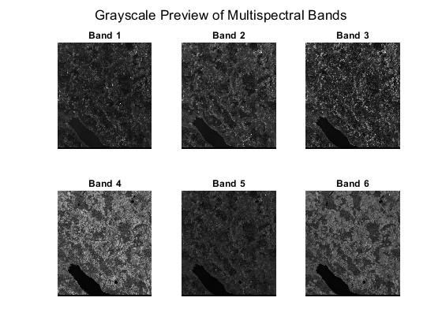
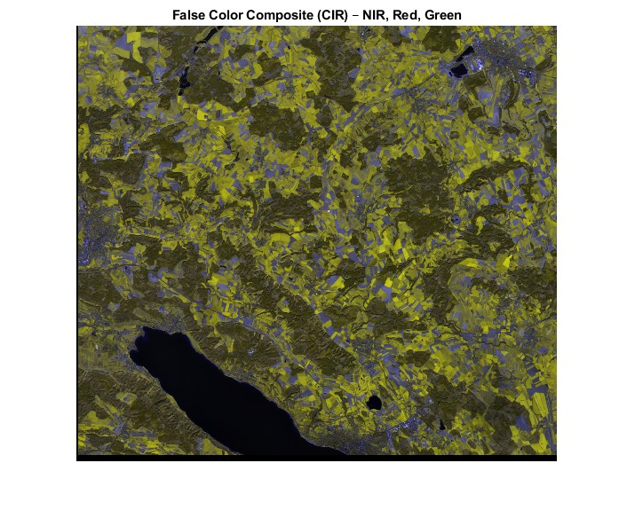
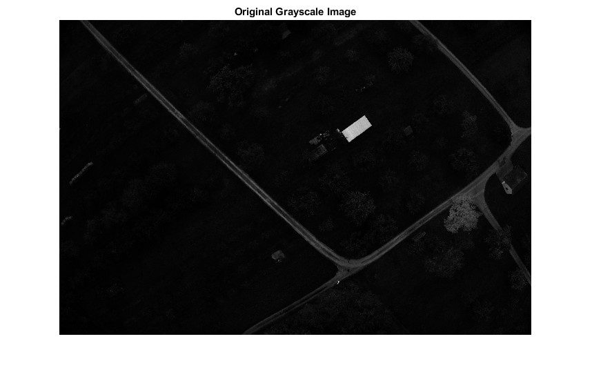
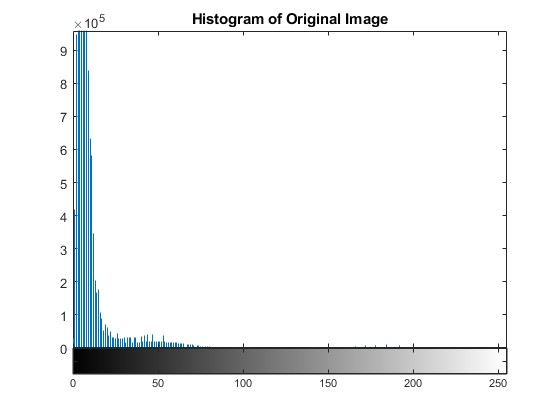
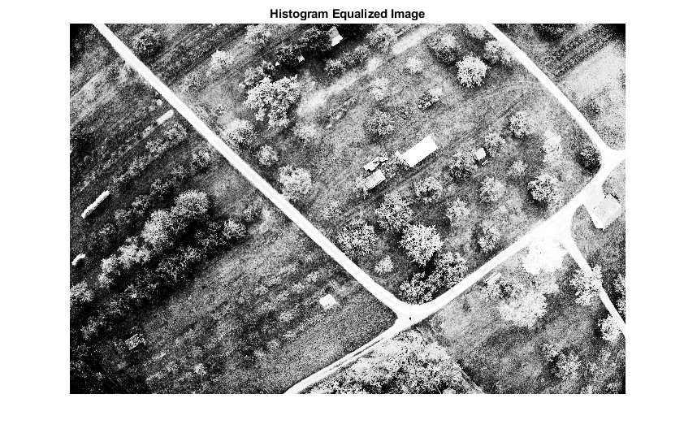

# Remote Sensing Image Analysis

A remote sensing image processing project focused on multispectral data visualization and image enhancement using MATLAB.

The project explores spectral information from multispectral imagery and applies histogram-based enhancement techniques to improve the visual interpretation of low-contrast remote sensing images.

## Project Overview

The project consists of two main image-processing workflows:

- Multispectral image exploration and visualization
- Histogram-based contrast enhancement

The analysis demonstrates how spectral bands can be combined for remote sensing visualization and how intensity distributions can be modified to improve image contrast.

## Multispectral Image Analysis

Multispectral imagery contains information recorded at different wavelength ranges. Individual spectral bands were inspected and visualized to understand their different responses.

### Spectral Band Visualization

Several multispectral bands were displayed as grayscale images for comparison.



### False-Color Composite

A false-color composite was generated using near-infrared, red, and green spectral information.

This type of visualization helps reveal spectral differences that may not be visible in a conventional RGB image.



## Histogram-Based Image Enhancement

The second part of the project investigates contrast enhancement of a low-intensity grayscale remote sensing image.

### Original Image

The original image has a relatively dark appearance with limited contrast.



### Intensity Distribution

The histogram shows that a large proportion of the pixel values are concentrated in the lower intensity range.



### Histogram Equalization

Histogram equalization was applied to redistribute image intensities and improve contrast. The enhanced image reveals considerably more detail in features such as roads, vegetation, and structures.



## Tools & Technologies

- MATLAB
- Remote sensing imagery
- Multispectral image processing
- Spectral band visualization
- False-color composites
- Histogram analysis
- Histogram equalization
- Image enhancement

## Key Skills Demonstrated

- Remote sensing image analysis
- Multispectral data processing
- Spectral visualization
- Image preprocessing
- Contrast enhancement
- Histogram analysis
- MATLAB programming
- Geospatial image interpretation

## Repository Structure

```text
Remote-Sensing-Image-Analysis/
├── README.md
├── src/
│   ├── 01-multispectral-image-analysis.m
│   └── 02-histogram-enhancement.m
└── images/
    ├── 01-multispectral-bands.jpg
    ├── 02-false-color-cir.jpg
    ├── 03-original-grayscale.jpg
    ├── 04-original-histogram.jpg
    └── 05-histogram-equalized.jpg
```

## Project Focus

This project demonstrates a practical workflow for exploring multispectral remote sensing data and improving image interpretability through basic image enhancement techniques.
